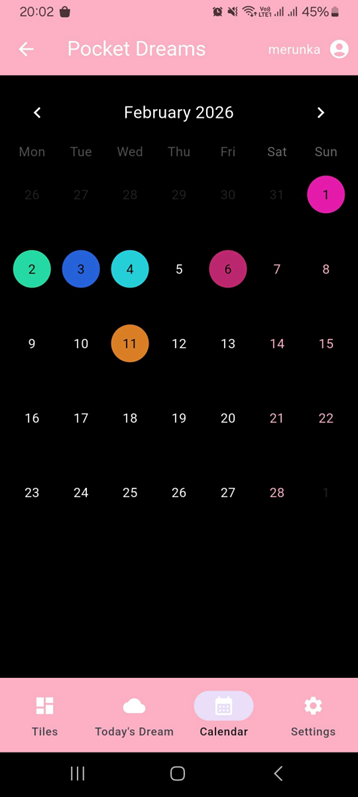

# Pocket Dreams

> **Note:** This project is my 2026 Graduation Project, which received the **maximum score** from the graduation committee.

**Pocket Dreams** is a mobile application dedicated to recording and sharing dreams. The core vision behind this project was to capture the essence of dreams while maintaining the visual uniqueness of each dream experience. 

By analyzing the emotions felt during sleep, the app generates unique colors for each dream, ensuring that every user's experience is visually distinctive and personal.

---

## Features

The application is logically divided into two main parts:

### Private Space (Personal Dream Journal)
* **Dream Recording:** Users can write down their dreams in detail.
* **Emotion Tracking & Color Mixing:** Users select the emotions they experienced during their dream. Each emotion corresponds to a specific color. When multiple emotions are selected, their colors blend together, creating a completely unique color gradient and aesthetic for that specific dream.
* **Dream Calendar:** A personal calendar view where users can track their dreaming history and revisit past dreams based on specific dates.

### Social Space (Community Feed)
* **Public Sharing:** When creating a dream entry, users have the option to make it public.
* **Dream Feed:** Public dreams are displayed in a community feed. To emphasize uniqueness, the feed is designed using a masonry layout (tiles of different sizes), with each tile colored according to the mixed emotions of that dream.
* **Interactivity:** Users can interact with the community by liking and commenting on public dreams.

---

## Screenshots
*(Here is a glimpse of the application's interface)*

<p align="center">
  
  
  
</p>

---

##  Database Architecture

The system utilizes a fully normalized **SQLite** database managed on the backend server. Data persistence is decoupled from individual devices so users can seamlessly access their profiles across platform instances.

### Key Structural Highlights:
* **Core Entities:** Centered around the `Dreams` and `Users` tables. Accounts are cryptographically secured using secure password hashing via the `bcrypt` library.
* **M:N Junction Tables:** To handle complex associations cleanly without text redundancy, relationships such as user likes, friendships, and dream tags/emotions are split into specialized junction tables (e.g., `DreamEmotions`, `DreamTags`, `Likes`, `Friendship`).
* **Constant Dictionaries (`Emotions` & `Tags`):** Fixed parameters are isolated into dictionary tables. This setup ensures database normalization, speeds up payload exchanges with the frontend (transferring simple integer arrays), and leaves the architecture fully prepared for multi-language localization.
* **Cross-Platform Type Mapping:** To bypass database serialization limits, the Flutter frontend converts native `DateTime` objects into a uniform integer format via a custom `dateToInt()` mapping before pushing to the SQLite instance, enabling robust, low-overhead sorting.
* **Dual-Layer Integrity Constraints:** Strict text boundaries are enforced both on the frontend (for interactive UI character counting) and the backend (as a security perimeter). For instance, dream descriptions have a data ceiling of 3,000 characters—a metric derived from personal data analysis.

<p align="center">
  
</p>
---

## Technologies Used

The project was built using a modern tech stack, ensuring cross-platform compatibility and efficient backend communication.

**Frontend:**
* **[Flutter](https://flutter.dev/):** UI toolkit used for building the natively compiled mobile application.
* **Dart:** The programming language used alongside Flutter.

**Backend & Database:**
* **[Flask](https://flask.palletsprojects.com/):** A lightweight WSGI web application framework based on **Python**, serving as the API and backend logic handler.
* **SQLite:** A C-language library that implements a small, fast, self-contained, high-reliability SQL database engine used for storing user data, dreams, emotions, and interactions.

---


## How to Run (Local Development)

Since the application is configured for a local development lifecycle, both the Flask API server and the Flutter frontend client must be spun up within your local environment.

### 1. Backend Server Setup (Flask)
The server establishes the database connection and exposes API endpoints for the client application.

1. Navigate to the backend source directory:
   ```bash
   cd backend
2. Set up and activate a isolated Python virtual environment:
   ```bash
   python -m venv venv
   source venv/bin/activate  # On Windows use: venv\Scripts\activate
4. Install the essential framework dependencies:
   ```bash
   pip install flask bcrypt
6. Start the local server instance:
   ```bash
   python app.py # The local API will spin up and listen natively at http://127.0.0.1:5000/.

### 2. Frontend Client Setup (Flutter)
Make sure you have the Flutter SDK configured and an active mobile emulator (or debugging device) running.

1. Navigate to the frontend workspace directory:
   ```bash
   cd frontend
2. Fetch the required package dependencies:
   ```bash
   flutter pub get
3. Network Configuration Note: Before building, open your API configuration script 
(e.g., constants.dart or your network service module) and redirect the base URL from localhost to your local machine's dedicated local network IP address (or 10.0.2.2 if you are verifying via a standard Android Emulator) so the client can reach the local machine's Flask server.
4. Launch the application:
   ```bash
   flutter run
---

## About The Project

This application was developed as my final graduation project ("Maturitní projekt") in 2026. The documentation and architectural design (including database normalization and API endpoint mapping) were thoroughly prepared alongside the development. 

The project successfully demonstrated the integration of a responsive frontend framework with a custom Python-based backend, alongside a creative UI/UX approach to data visualization (emotion color mixing).
