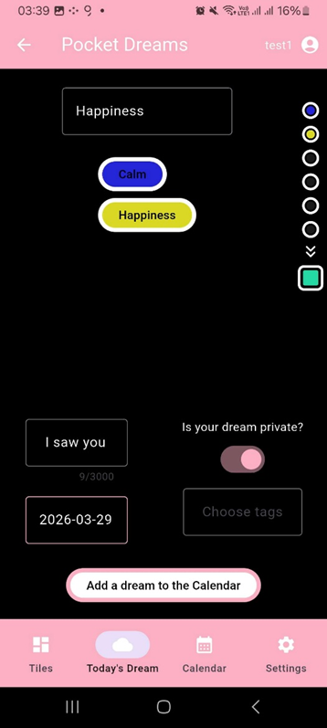
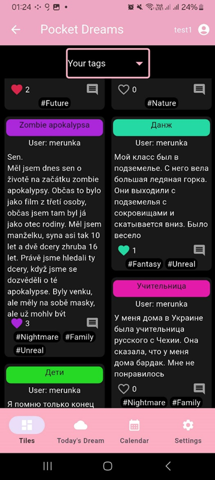

# Pocket Dreams

> **Note:** This project is my 2026 Graduation Project, which received the **maximum score** from the graduation committee.

**Pocket Dreams** is a mobile application dedicated to recording and sharing dreams. The core vision behind this project was to capture the essence of dreams while maintaining the visual uniqueness of each dream experience. 

By analyzing the emotions felt during sleep, the app generates unique colors for each dream, ensuring that every user's experience is visually distinctive and personal.

---

## Features

The application is logically divided into two main parts:

### Private Space (Personal Dream Journal)
* **Dream Recording:** Users can write down their dreams in detail.
* **Emotion Tracking & Color Mixing:** Users select the emotions they experienced during their dream. Each emotion corresponds to a specific color. When multiple emotions are selected, their colors blend together, creating a completely unique color gradient and aesthetic for that specific dream.
* **Dream Calendar:** A personal calendar view where users can track their dreaming history and revisit past dreams based on specific dates.

### Social Space (Community Feed)
* **Public Sharing:** When creating a dream entry, users have the option to make it public.
* **Dream Feed:** Public dreams are displayed in a community feed. To emphasize uniqueness, the feed is designed using a masonry layout (tiles of different sizes), with each tile colored according to the mixed emotions of that dream.
* **Interactivity:** Users can interact with the community by liking and commenting on public dreams.

---

## Screenshots
*(Here is a glimpse of the application's interface)*

  
  
  

---

## Technologies Used

The project was built using a modern tech stack, ensuring cross-platform compatibility and efficient backend communication.

**Frontend:**
* **[Flutter](https://flutter.dev/):** UI toolkit used for building the natively compiled mobile application.
* **Dart:** The programming language used alongside Flutter.

**Backend & Database:**
* **[Flask](https://flask.palletsprojects.com/):** A lightweight WSGI web application framework based on **Python**, serving as the API and backend logic handler.
* **SQLite:** A C-language library that implements a small, fast, self-contained, high-reliability SQL database engine used for storing user data, dreams, emotions, and interactions.

---

## About The Project

This application was developed as my final graduation project ("Maturitní projekt") in 2026. The documentation and architectural design (including database normalization and API endpoint mapping) were thoroughly prepared alongside the development. 

The project successfully demonstrated the integration of a responsive frontend framework with a custom Python-based backend, alongside a creative UI/UX approach to data visualization (emotion color mixing).
